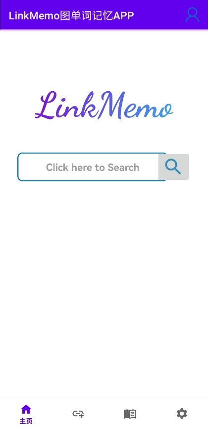
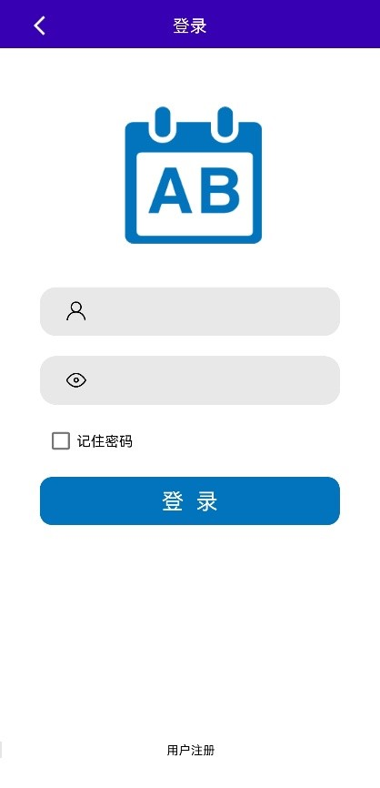
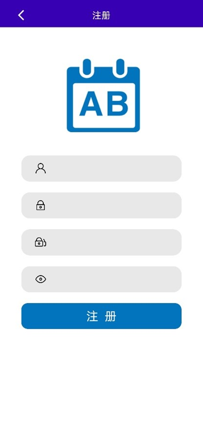
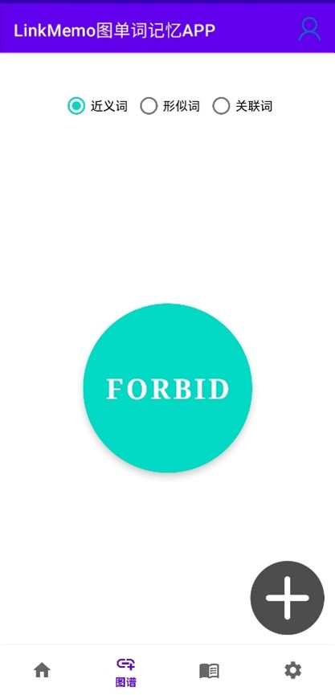
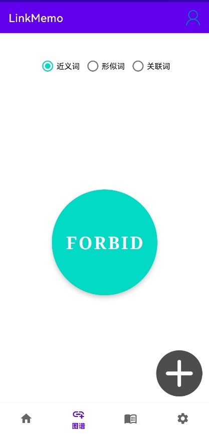
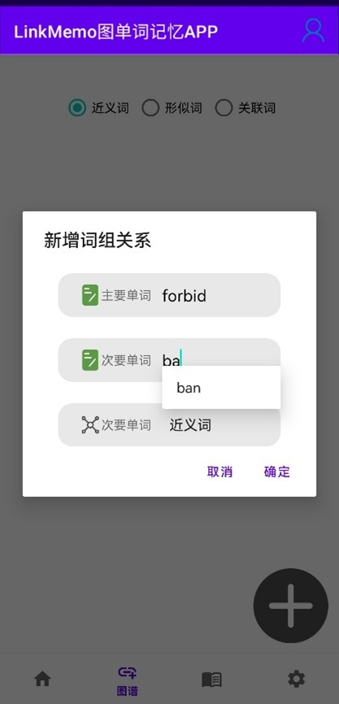
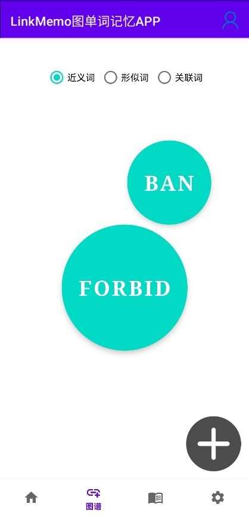
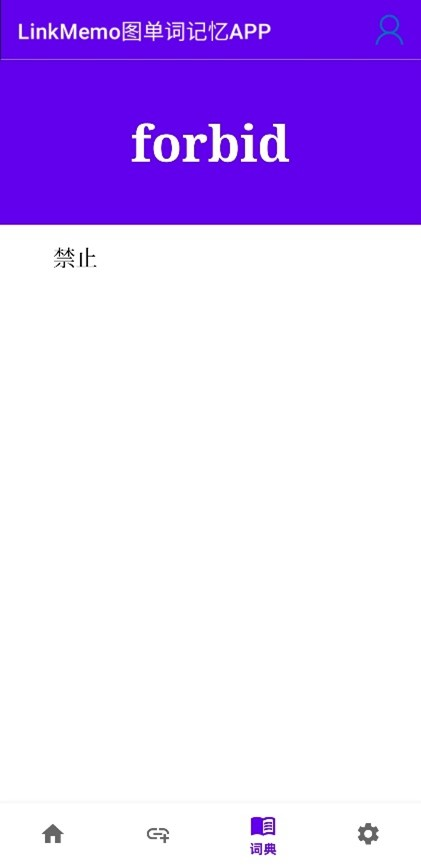

# LinkMemo图单词记忆APP V1.0

# 1 简介

“LinkMemo图单词记忆”是一个专为英语学习者设计的APP应用，旨在通过图形化的单词关联帮助用户加深对英语单词及其联系的理解。通过本应用，用户可以查询单词，查看与之关联的近义词、反义词等，并可自定义添加或删除关联，优化个人学习体验。

项目进行期间，团队致力于基于word2vec算法，构建关联型数据库neo4j，并结合Android Studio+Springboot框架，打造了一款可自定义的图谱系统。该系统的目标是辅助学习者对具有近义、形近等特征的易混淆词汇进行记忆。通过核心算法的与图数据库创新性结合、系统设计与构建、前后端的实现等步骤，力图为学生提供一种以链接为核心记忆逻辑的记忆方式。

# 2 快速开始

开始使用前，请确保您已下载本应用并在您的设备上成功安装。打开应用后，您需要注册并登录账户以访问所有功能。

# 3 功能说明

## 3.1 主界面

进入：初始默认界面

功能：提供访问所有基础功能的入口，包括搜索栏、用户账号（右上角）、底部菜单（主页、关联界面、单词释义）选项。

## 3.2 注册与登录界面

  

进入：主界面右上角进入用户登录界面

操作：新用户点击下方“用户注册”创建账户，确认注册后，自动返回登陆界面，输入用户名和密码，点击“登录”按钮进行登录。

## 3.3 单词关联展示

  

进入：在主页搜索框中输入需要搜索的单词，点击搜索按钮，若该单词存在，则进入关联展示界面；若不存在，则提示“该单词未收录”

操作：

点击中心单词，可进入单词释义界面。

点击周围任一显示的关联单词，可将其切换为中心单词，查看该单词的关联单词。

点击上方的单选框，可切换展示该单词的近义词/形近词/关联词。

## 3.4 添加关联

进入：点击右下角“+”按钮，开始为当前单词添加关联

操作：

在主要单词框中，自动填充不可更改的当前单词

在次要单词框中，输入想要关联的单词，会自动弹出下拉框搜索与当前输入内容匹配的单词，仅能添加数据库中已经存在的单词（数据库已导入字典）

最后选择关联类型（如近义、反义），然后点击“确定”，即成功添加。

## 3.5 单词释义

进入：点击关联展示界面的中心单词的圆圈，进入该单词释义界面。

操作：浏览详细信息。

# 4 图数据库设计

## 4.1  意近判断标准

使用了"word2vec-google-news-300"模型，处理数据并获取单词向量表示，这使能够测量单词之间的语义相似性，解决基于含义的相似性，为每个单词获取了向量表示。

## 4.2 形近判断标准

Levenshtein距离是一种常见的度量标准。它可以通过确定将一个字符串转换为另一个字符串所需的最小插入、删除和替换操作数量来计算两个字符串之间的相似性。

## 4.3 Neo4j图数据库构建

利用聚类和最近邻算法的结果，构建一个Neo4j知识图谱。每个单词及其最相关的单词一起成为一个节点，它们之间的连接表示形式上或含义上的相似性，并具有明确定义的属性。

